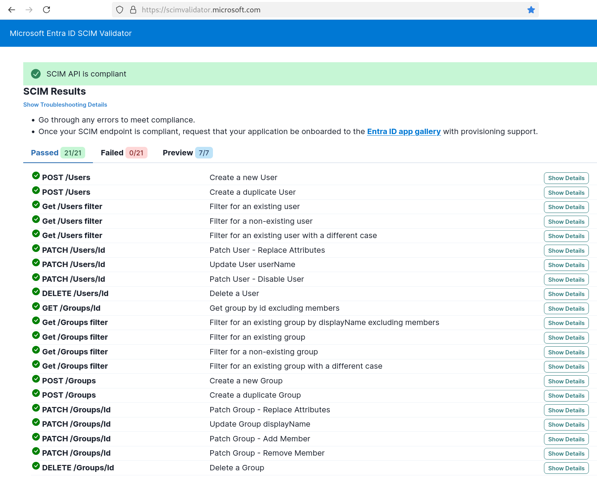

# node-scim

> [!CAUTION]
> This repository is still at the proof-of-concept stage and
> should definitely not be used in a production setting

This aims to be a SCIM (v2) client, currently targeting Firebase Authentication w/ Google Identity Platform 
(intention to eventually support multiple targets via an adapter pattern).

It makes use of code generation using https://openapi-code-generator.nahkies.co.nz to generate the server routing and
validation glue from the [./openapi.yaml](./openapi.yaml). (`yarn generate` will regenerate after changes to the openapi spec)

I couldn't find a complete openapi specification for SCIM v2, so it's cobbled together from a combination of translating
the RAML definition found at https://github.com/sudobinbash/okta-scim-mulesoft and adjusting by hand
w.r.t [RFC 7643](https://datatracker.ietf.org/doc/html/rfc7643) and trial/error testing the integration using
[Keycloak](https://www.keycloak.org/) with this plugin https://github.com/mitodl/keycloak-scim/.

Its definitely still inaccurate, and help solidifying it would be appreciated.

## What works

Basic functionality should work. You can create / delete users E2E, and update them, filter, etc. 
An in-memory groups implementation partially works.

It currently passes all the tests at https://scimvalidator.microsoft.com/



## Running

You'll need:

- A GCP / Firebase auth project using Google Identity platform
- To configure an OIDC provider as an authentication method
- To configure your OIDC provider to use SCIM with this project as the SCIM client.
- Run in a context that is authenticated with GCP using [application default credentials](https://cloud.google.com/docs/authentication/application-default-credentials)

1. Clone
2. Install dependencies `yarn`
3. Configure (`cp .env.example .env` and edit, see below)
4. Run `yarn dev`

Configuration reference:

```shell
PORT=2000 # port to listen on
SECRET_KEY=some-secret-key # the content of the Bearer token, shared secret between OIDC provider and SCIM client
PROJECT_ID=gcp-project-id # the GCP/Firebase project id
PROVIDER_ID=auth-provider-id # the Firebase authentication method id, eg: oidc.my-okta-integration
```
